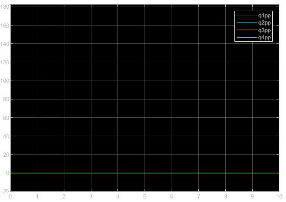

# Robot-LS6-60S2
## Modelado dinámico
### Modelo dinámico en forma matricial
```sh
        M =[ (39*cos(q2 + q4))/1250 + (251459*cos(q2))/400000 + (33*cos(q4))/1250 + 2738753/2000000, (39*cos(q2 + q4))/2500 + (251459*cos(q2))/800000 + (33*cos(q4))/1250 + 3711731/4000000,       0, (39*cos(q2 + q4))/2500 + (33*cos(q4))/2500 + 147/2500;
         (39*cos(q2 + q4))/2500 + (251459*cos(q2))/800000 + (33*cos(q4))/1250 + 3711731/4000000,                          (33*cos(q4))/1250 + 65297462298826248931/70368744177664000000,       0,                          (33*cos(q4))/2500 + 147/2500;
                                                                                      0,                                                                                      0, 123/100,                                                     0;
                                  (39*cos(q2 + q4))/2500 + (33*cos(q4))/2500 + 147/2500,                                                           (33*cos(q4))/2500 + 147/2500,       0,                                              147/2500];

 ```
### Vector de fuerzas gravitacionales
```sh
        G =[     0;
                 0;
           12.0663;
                 0];
 ```
### Fuerzas de coriolis
```sh
        C =[- (251459*q2p^2*sin(q2))/800000 - (33*q4p^2*sin(q4))/2500 - (39*q2p^2*sin(q2 + q4))/2500 - (39*q4p^2*sin(q2 + q4))/2500 - (251459*q1p*q2p*sin(q2))/400000 - (33*q1p*q4p*sin(q4))/1250 - (33*q2p*q4p*sin(q4))/1250 - (39*q1p*q2p*sin(q2 + q4))/1250 - (39*q1p*q4p*sin(q2 + q4))/1250 - (39*q2p*q4p*sin(q2 + q4))/1250;
                                                                                                                                                                       (251459*q1p^2*sin(q2))/800000 - (33*q4p^2*sin(q4))/2500 + (39*q1p^2*sin(q2 + q4))/2500 - (33*q1p*q4p*sin(q4))/1250 - (33*q2p*q4p*sin(q4))/1250;
                                                                                                                                                                                                                                                                                                                    0;
                                                                                                                                                                                                         (33*q1p^2*sin(q4))/2500 + (33*q2p^2*sin(q4))/2500 + (39*q1p^2*sin(q2 + q4))/2500 + (33*q1p*q2p*sin(q4))/1250];                              
    
 ```
### Fuerza externa
```sh
        Fext = [fy05*0.325*cos(q1) - fx05*0.325*sin(q1) + fy05*0.275*cos(q1 + q2) - fx05*0.275*sin(q1 + q2);
                                                          fy05*0.275*cos(q1 + q2) - fx05*0.275*sin(q1 + q2);
                                                                                                       fz05;
  
 ```
### Vector de friccion
```sh
        f=[1*q1p;0.123*q2p;2*q3p;0.123*q4p];
 ```
## Dinámica Inversa
Debido a que el fabricante no proporciona especificaciones de los motores, se propusieron las siguientes saturaciones:
 Para q1 [20, -20]
 Para q2 [25, -25]
 para q3 [16, -16]
 Para q4 [5, -5]
 
 
 
### Evaluación Tramo 1


Para el tramo 1 de la trayectoria propuesta el unico torque visible es el de q3, lo cual es correcto pues solo existe un desplazamiento en Z.

### Evaluación Tramo 2


Para el tramo 2 se ven distintos valores de torques para los 3 motores q1, q2 y q3. (q4 no actúa en la trayectoria del robot).

### Evaluación Tramo 3


Para el tramo 3 de la trayectoria propuesta el unico torque visible es el de q3, lo cual es correcto pues solo existe un desplazamiento en Z.

### Evaluación Tramo 4


Para el tramo 4 se ven distintos valores de torques para los 3 motores q1, q2 y q3. (q4 no actúa en la trayectoria del robot).

Se concluye que, para la trayectoria propuesta en la cinemática, los torques son correctos y están dentro de las magnitudes soportadas por los motores. 

### Fuerzas externas

a)Fuerza externa Fz=200N


El movimiento es el esperado, el eslabon 3 se mueve en dirección Z rápidamente a causa de la gran fuerza que actúa y en la gráfica de aceleraciones se puede ver la aceleración inicial para despues llegar a una velocidad constante.

b)Fuerza externa Fx=200N




El movimiento esperado era un movimiento en X, sin embargo, no se mueve ni un poco y esto se puede deber a las restricciones que tiene el modelo, pues si tuviera movimiento en X el robot estaría "libre", en la gráfica de aceleraciones como se puede ver no existe aceleración en ningun motor.

c)Fuerza externa Fx=20000000N


A pesar de que se aumenta demasiado el valor de la fuerza, no hay movimiento, por lo tanto se optó por aplicar una fuerza en Y.

d)Fuerza externa Fy=200N


El movimiento es el esperado, la fuerza en Y provoca que el robot pierda su estabilidad, tambien se nota que en todas las juntas tienen aceleración excepto q3. 
